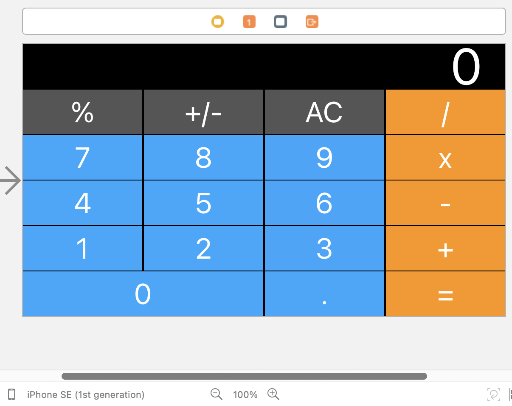
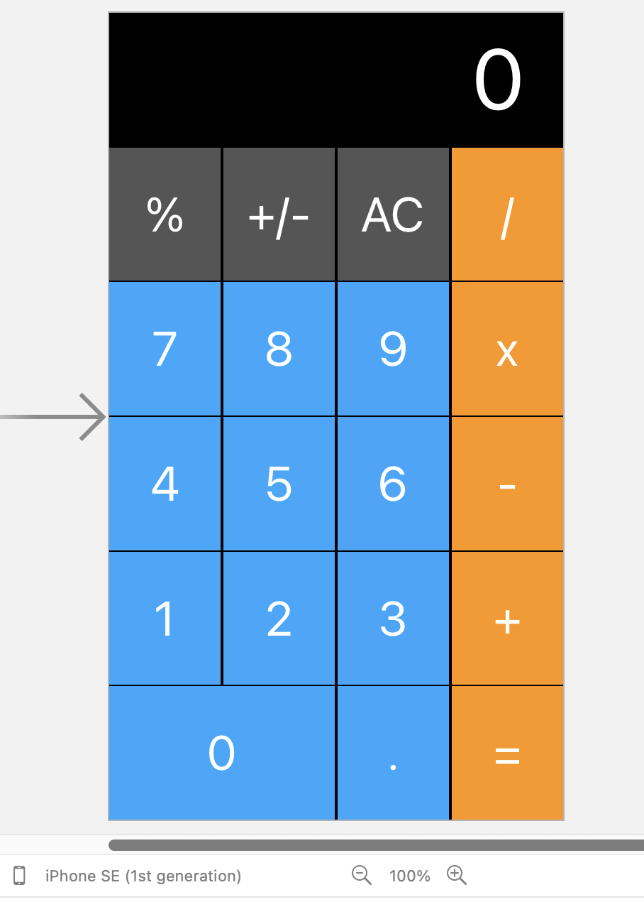
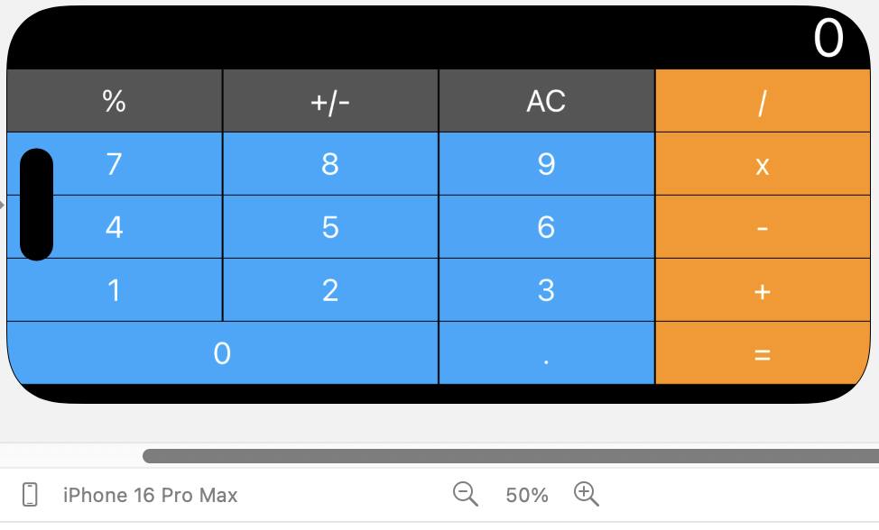
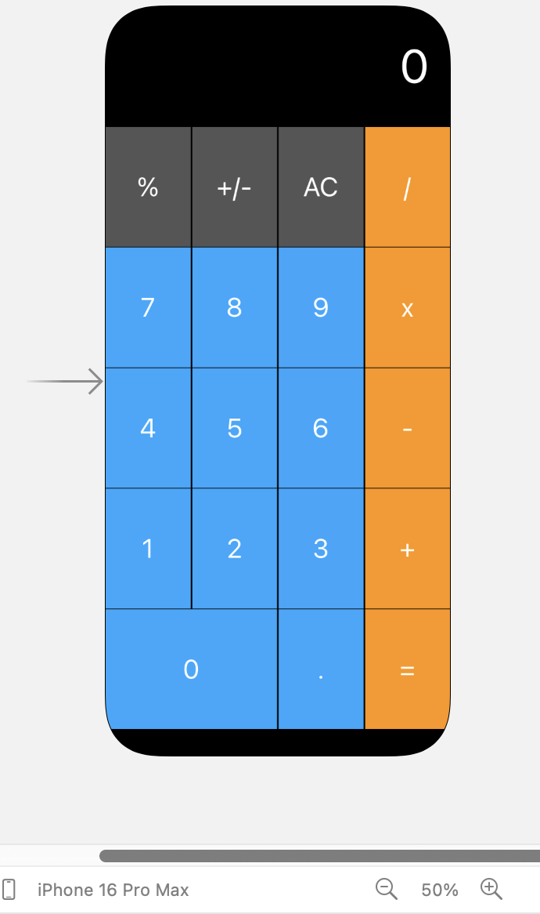
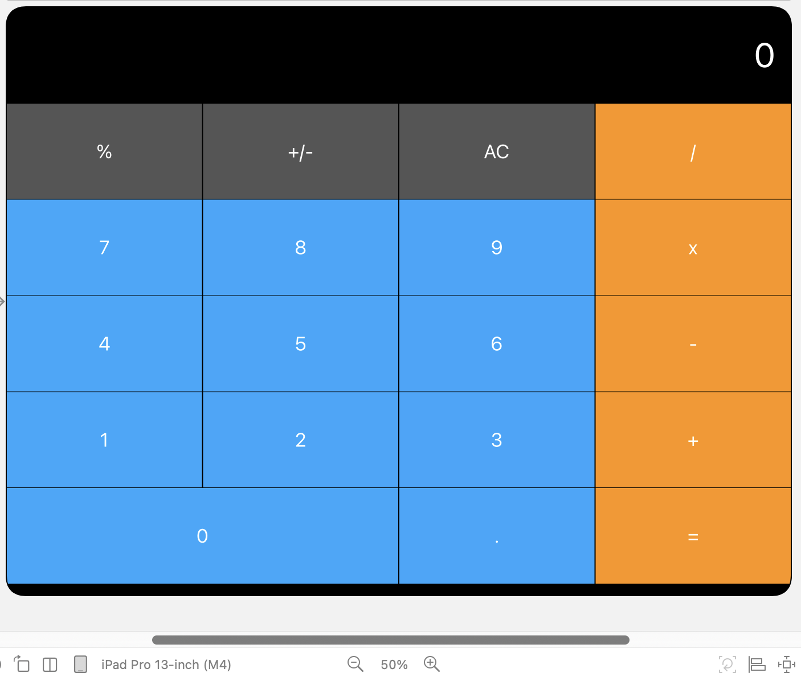
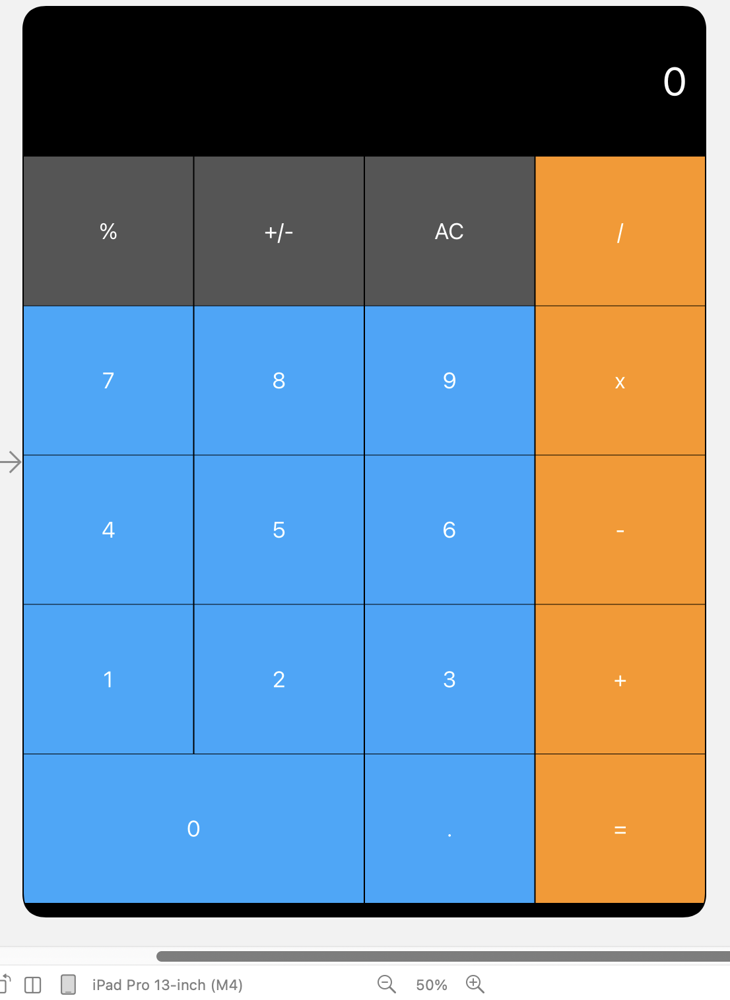

# Project Name: **[iOS Calculator]**

## Screenshots

### 1. **Small iPhone**

### 2. **iPhone 16 Pro max**

### 3. **iPad**

---

## Technologies Used

- **Language**: Swift
---

## Contact

For any questions or inquiries, feel free to reach out to:

- **Email**: [iamadilmalick@gmail.com]
- **GitHub**: [https://github.com/adilexperience](https://github.com/adilexperience)
